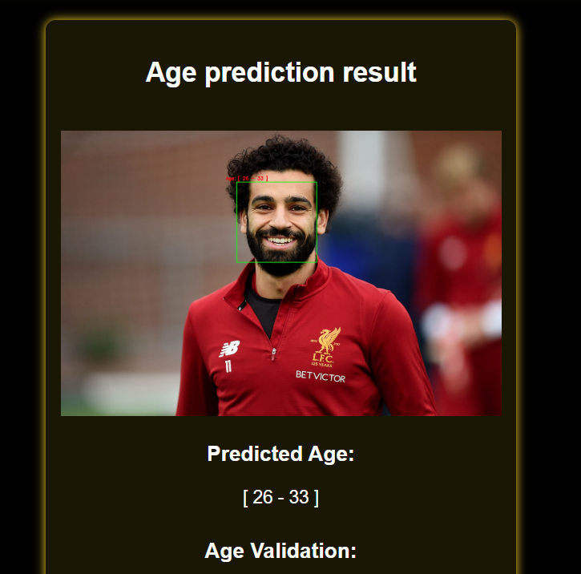
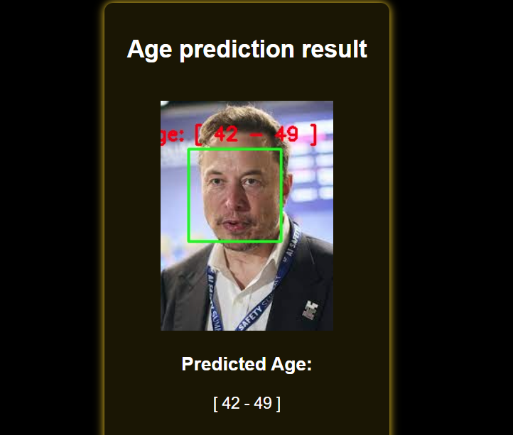

# 👨🦳👩 Age Prediction from Images 🧒👵

 <!-- Add your banner image -->

A deep learning project that predicts age ranges from facial images with a single photo input.

[](https://python.org)
[](LICENSE)
[](https://colab.research.google.com/github/yourusername/your-repo/)

## 🎥 Demo Video
[](https://youtu.be/your-video-link) <!-- Upload video to YouTube and embed -->

## ✨ Features
- 📷 Face detection and alignment
- 🧠 Deep learning-based age estimation
- 📊 Age range prediction (e.g., 20-30, 30-40)
- 🚀 Ready-to-use API

## 🖼️ Sample Results
| Input Image | Prediction |
|-------------|------------|
|  | Predicted Age: 25-30 |
|  | Predicted Age: 40-45 |

## 🛠️ Installation
```bash
git clone https://github.com/yourusername/age-prediction.git
cd age-prediction
pip install -r requirements.txt

Technology Stack
Python 3.9
TensorFlow/Keras 
OpenCV (for face detection)
Firebase (for database)
fastapi ( for api)


