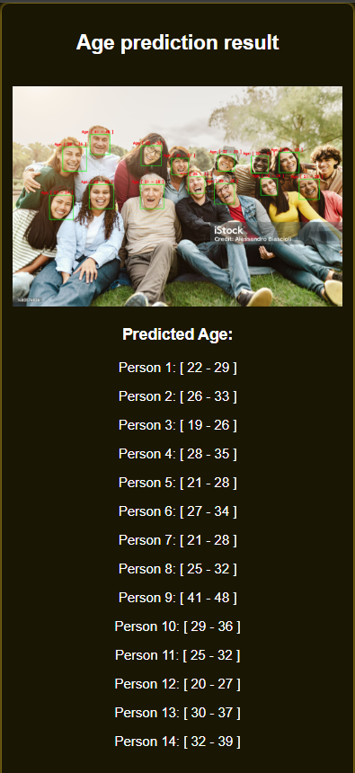

# 👨🦳👩 Age Prediction from Images 🧒👵


A deep learning project that predicts age ranges from facial images with a single photo input.


## 🎥 Demo Video
[](https://youtu.be/your-video-link) <!-- Upload video to YouTube and embed -->

## ✨ Features
- 📷 Face detection and alignment
- 🧠 Deep learning-based age estimation
- 📊 Age range prediction (e.g., 20-30, 30-40)
- 🚀 Ready-to-use API

## 🖼️ Sample Results
| Input Image | Prediction |
|-------------|------------|
|  | Predicted Age: 26-33 |
|  | Predicted Age: 42-49 |
|  | Predicted Age:
[22 - 29]

[26 - 33]

[19 - 26]

[28 - 35]

[21 - 28]

[27 - 34]

[21 - 28]

[25 - 32]

[41 - 48]

[29 - 36]

[25 - 32]

[20 - 27]

[30 - 37]

[32 - 39] |


## 🛠️ Technology Stack

### Core Frameworks

<table>
  <tr>
    <td align="center" width="120">
      <a href="https://www.python.org/downloads/release/python-3913/" target="_blank">
        
        <br>
        <b>Python 3.9+</b>
      </a>
      <br>
      <a href="https://www.python.org/downloads/release/python-3913/">
        
      </a>
    </td>
    <td align="center" width="120">
      <a href="https://www.tensorflow.org/" target="_blank">
        
        <br>
        <b>TensorFlow 2.12+</b>
      </a>
      <br>
      <a href="https://pypi.org/project/tensorflow/">
        
      </a>
    </td>
    <td align="center" width="120">
      <a href="https://fastapi.tiangolo.com/" target="_blank">
        
        <br>
        <b>FastAPI 0.95+</b>
      </a>
      <br>
      <a href="https://pypi.org/project/fastapi/">
        
      </a>
    </td>
  </tr>
</table>

### Computer Vision & AI

<table>
  <tr>
    <td align="center" width="120">
      <a href="https://opencv.org/" target="_blank">
        
        <br>
        <b>OpenCV 4.7+</b>
      </a>
      <br>
      <a href="https://pypi.org/project/opencv-python/">
        
      </a>
    </td>
    <td align="center" width="120">
      <a href="http://dlib.net/" target="_blank">
        
        <br>
        <b>dlib 19.24+</b>
      </a>
      <br>
      <a href="https://pypi.org/project/dlib/">
        
      </a>
    </td>
    <td align="center" width="120">
      <a href="https://github.com/serengil/deepface" target="_blank">
        
        <br>
        <b>DeepFace 0.0.79+</b>
      </a>
      <br>
      <a href="https://pypi.org/project/deepface/">
        
      </a>
    </td>
  </tr>
</table>

### Essential Libraries

<table>
  <tr>
    <td align="center" width="120">
      <a href="https://numpy.org/" target="_blank">
        
        <br>
        <b>NumPy 1.24+</b>
      </a>
      <br>
      <a href="https://pypi.org/project/numpy/">
        
      </a>
    </td>
    <td align="center" width="120">
      <a href="https://python-pillow.org/" target="_blank">
        
        <br>
        <b>Pillow 9.5+</b>
      </a>
      <br>
      <a href="https://pypi.org/project/Pillow/">
        
      </a>
    </td>
    <td align="center" width="120">
      <a href="https://firebase.google.com/docs/admin/setup" target="_blank">
        
        <br>
        <b>Firebase Admin 6.4+</b>
      </a>
      <br>
      <a href="https://pypi.org/project/firebase-admin/">
        
      </a>
    </td>
  </tr>
</table>

### Web & Utilities

<table>
  <tr>
    <td align="center" width="120">
      <a href="https://www.uvicorn.org/" target="_blank">
        
        <br>
        <b>Uvicorn 0.22+</b>
      </a>
      <br>
      <a href="https://pypi.org/project/uvicorn/">
        
      </a>
    </td>
    <td align="center" width="120">
      <a href="https://andrew-d.github.io/python-multipart/" target="_blank">
        
        <br>
        <b>python-multipart</b>
      </a>
      <br>
      <a href="https://pypi.org/project/python-multipart/">
        
      </a>
    </td>
  </tr>
</table>

> All version numbers are minimum requirements. For production use, pin exact versions in `requirements.txt`

### Key Libraries
```python
- NumPy        # Numerical operations
- Pandas       # Data handling
- Matplotlib   # Visualization
- Dlib         # Facial landmark detection (optional)
- Pillow       # Image processing

